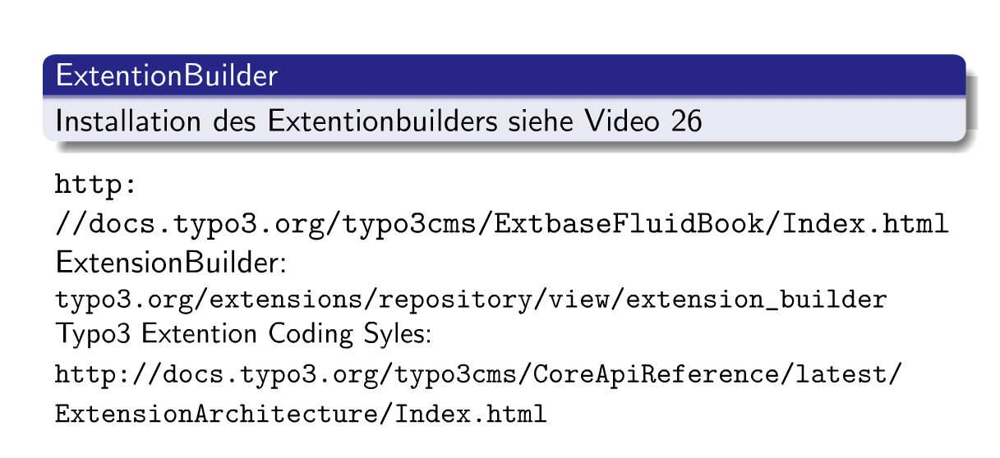

# Typoscript und Fluid

http://www.oliver-thiele.de/cms-typo3/tsref/cobjects/coa.html


### Begriffe und Abkürzungen
* COA: (Content object array) Zur Gruppierung von cObjects


```
= Wert setzen
< Wert kopieren
<= Wert referenzieren
```


### Config
```
config {
	concatenateJs = 1
	concatenateCss = 1
	compressJs = 1
	compressCss = 1
}
```

### TS-Includes
```
<INCLUDE_TYPOSCRIPT: source="FILE:fileadmin/ts/config.ts">
```


### PAGE-Objekt
```
page = PAGE
page.10 = TEXT
page.10.value = Hello, world!
page.10.wrap = <h2>|</h2>
—————————————————————————————————
page = PAGE
page {
	10 = TEXT
	10 {
		value = Hello, world!
		wrap = <h2>|</h2>
	}
}
```


```
10 = FLUIDTEMPLATE
10 {
	variables {
		content < styles.content.get
		contentright < styles.content.getRight
		contentleft < styles.content.getLeft
		contentborder < styles.content.getBorder
		
	}
}
————————————————————————————————
<div class="col-xs-3">
	<f:format.raw>{contentleft}</f:format.raw>
</div>
<div class="col-xs-6">
	<f:format.raw>{content}</f:format.raw>
</div>
<div class="col-xs-3">
	<f:format.raw>{contentright}</f:format.raw>
</div>
```

### Bild in Fluid (...aber besser nicht so!)
```
<f:image src="/fileadmin/.../logo.png" alt="" />
```

### Bild in TS
```
Logo = IMAGE
Logo {
	file = /fileadmin/.../omi-logo.jpg
	file.width = 200
	file.height = 300
}
———————————————————————————
<f:format.raw>{Logo}</f:format.raw>
```

```
bild = TEXT
bild {
	value = 
	typolink.parameter = 2
}
———————————————————————————
<f:format.raw>{bild}</f:format.raw>
```

```
Bild = IMAGE
Bild {
	file = /fileadmin/.../omi-logo.jpg
	file.width = 1200
	file.height = 300
	params = class="img-responsive img-rounded"
}
Bild.wrap = <div>|</div>
```


### DB Abfrage
```
sel = CONTENT
sel {
	table = tt_content
	select {
		orderBy = sorting
		where = colPos = 0
	}
}
```

### Fluid inc
```
<f:cObject typoscriptObjectPath="lib.mainNavi" />
```


### Seiten-Inhaltselemente
```
page.10.marks.LINKS >
page.10.marks.LINKS = COA_INT
page.10.marks.LINKS {
	# Anzeige der Inhaltselemente aus Seite 125
	30 = CONTENT
	30 {
		table = tt_content
		select {
			pidInList = 125
			orderBy = RAND()
			max = 1
			where = (colPos=0 OR colPos=1)
			languageField = sys_language_uid
		}
	}
}
```

### Einfache Navigation
```
lib.mainNavi = HMENU
lib.mainNavi.entryLevel = 0
lib.mainNavi.1 = TMENU
lib.mainNavi.1 {
	wrap = <ul class="nav navbar-nav">|</ul>
	expAll = 0
	NO.allWrap = <li>|</li>
	RO < .NO
	RO = 1
	CUR < .NO
	CUR = 1
	CUR.allWrap = <li class="active">|</li>
	ACT< .CUR
}
```

### Multilevel-Navi
...siehe ts-Verzeichnis
Benötigt: http://www.bootsnipp.com/snippets/featured/multi-level-dropdown-menu-bs3


### Extentions: Erweiterungen installieren

